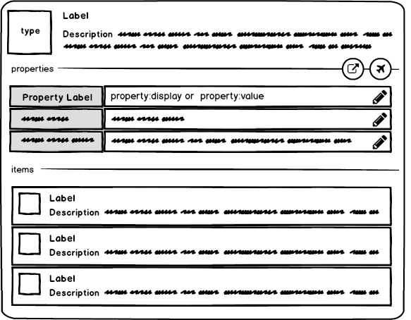
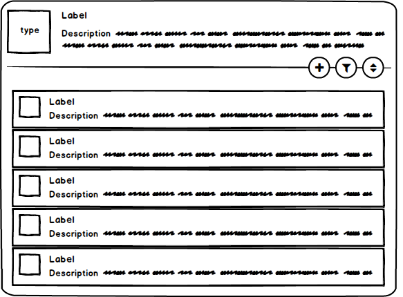
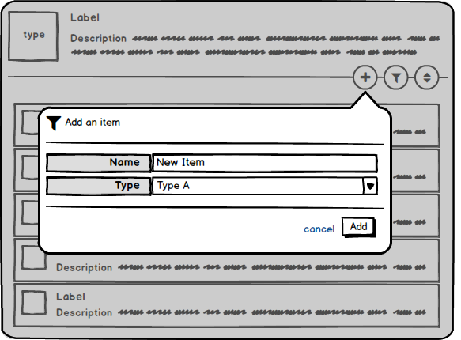
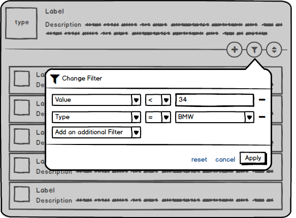
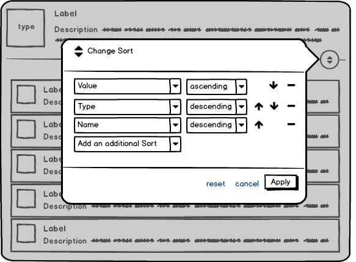
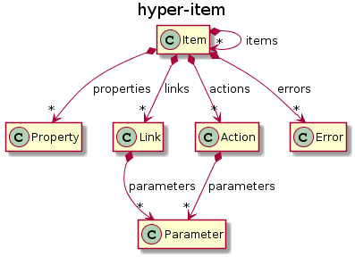

# Hyper-Item: a hypermedia specification

Your input is appreciated. Feel free to file a GitHub Issue, a Pull Request, or contact me on Twitter [@MarioDemuth](https://twitter.com/MarioDemuth). Thank you!

## Contents

1. [Description](#1-description)
2. [Examples](#2-examples)
3. [Concepts](#3-concepts)
4. [Extensibility](#4-extensibility)
5. [FAQ](#5-faq)
6. [Food for Thought](#6-food-for-thought)
7. [Related Material](#7-related-material)


> **NOTE**: 
> The key words "MUST", "MUST NOT", "REQUIRED", "SHALL", "SHALL NOT", "SHOULD", "SHOULD NOT", "RECOMMENDED", "MAY", and "OPTIONAL" in this document are to be interpreted as described in [RFC 2119](https://tools.ietf.org/html/rfc2119).

## 1. Description

Hyper-Item is a hypermedia type that tries to combine the best parts of the [Collection+JSON](http://amundsen.com/media-types/collection/) and [Siren](https://github.com/kevinswiber/siren) media types to enable the creation of [task-based](https://cqrs.wordpress.com/documents/task-based-ui/)/[inductive](https://msdn.microsoft.com/en-us/library/ms997506.aspx) user interfaces that have the ability to be extended by new features (properties, links, actions and sub-items) at runtime.

If you have a Hyper-Item client feel free to say *hi* my demo API at [http://hi.cognicraft.net](http://hi.cognicraft.net) and try to follow links and submit actions.

The media type for Hyper-Item in JSON is [`application/vnd.hyper-item+json`](https://www.iana.org/assignments/media-types/application/vnd.hyper-item+json).



The image above shows how an item in a generic task-based UI might look like.



The image above shows a representation of a generic collection.



The image above shows a representation of a generic action component.



The image above shows a representation of a generic filter component.



The image above shows a representation of a generic sort component.

## 2. Examples

### 2.1. A User Collection

The following example shows a list of users configured within an exemplary *auth* service. The `self` link shows that his collection has been filtered to only include users that have had their last-login before noon on Jan 9 2017 and sorted by the users name in ascending order. A new user may be added to this collection by means of submitting the `add-user` action.

```
{
    "label": "Users",
    "type" : "users",
    "items":[
        {
            "label": "Alice",
            "type": "user",
            "id": "0001",
            "properties": [
                {
                    "label": "Name",
                    "type": "text",
                    "name": "name",
                    "value": "Alice"
                },
                {
                    "label": "Status",
                    "type": "text",
                    "name": "status",
                    "value": "activated",
                    "display": "Activated"
                },
                {
                    "label": "Last Login",
                    "type": "date",
                    "name": "last-login",
                    "value": "2017-01-08T15:09:12Z",
                    "display": "Jan 8, 2017"
                }
            ],
            "links": [
                {
                    "label": "Details",
                    "rel": "details",
                    "href": "/auth/users/0001"
                }
            ]
        },
        {
            "label": "Bob",
            "type": "user",
            "id": "0002",
            "properties": [
                {
                    "label": "Name",
                    "type": "text",
                    "name": "name",
                    "value": "Bob"
                },
                {
                    "label": "Status",
                    "type": "text",
                    "name": "status",
                    "value": "deactivated",
                    "display": "Deactivated"
                },
                {
                    "label": "Last Login",
                    "type": "date",
                    "name": "last-login",
                    "value": "2017-01-09T06:12:18Z",
                    "display": "Jan 9, 2017"
                }
            ],
            "links": [
                {
                    "label": "Details",
                    "rel": "details",
                    "href": "/auth/users/0002"
                }
            ]
        }
    ],
    "links":[
        {
            "label": "Reload",
            "rel": "self",
            "href": "/auth/users/?sort=name,ASC&filter=last-login,lt,2017-01-09T12:00:00Z"
        },
        {
            "label": "Filter",
            "rel": "filter",
            "template": "/auth/users/?sort=name,ASC{&filter*}",
            "parameters": [
                {
                    "name": "filter",
                    "type": "filter",
                    "components": [
                        {
                            "label": "Name",
                            "name": "name",
                            "type": "text",
                            "operators": [
                                {
                                    "label": "Like",
                                    "operator": "like"
                                },
                                {
                                    "label": "Not Like",
                                    "operator": "nlike"
                                }
                            ]
                        },
                        {
                            "label": "Status",
                            "name": "status",
                            "type": "select",
                            "operators": [
                                {
                                    "label": "=",
                                    "operator": "eq"
                                },
                                {
                                    "label": "!=",
                                    "operator": "neq"
                                }
                            ],
                            "options": [
                                {
                                    "label": "Activated",
                                    "value": "activated"
                                },    
                                {
                                    "label": "Deactivated",
                                    "value": "deactivated"
                                }                              
                            ]
                        },
                        {
                            "label": "Last Login",
                            "name": "last-login",
                            "type": "date",
                            "operators": [
                                {
                                    "label": "Before",
                                    "operator": "lt"
                                },
                                {
                                    "label": "After",
                                    "operator": "gt"
                                }
                            ]
                        },
                    ],
                    "value": [
                        {
                            "name": "last-login",
                            "operator": "lt",
                            "value": "2017-01-09T12:00:00Z"
                        }
                    ]
                }
            ]
        },
        {
            "label": "Sort",
            "rel": "sort",
            "template": "/auth/users/?filter=last-login,lt,2017-01-09T12:00:00Z{&sort*}",
            "parameters": [
                {
                    "name": "sort",
                    "type": "sort",
                    "components":[
                        {
                            "label": "Name",
                            "name": "name",
                            "orders": [
                                {
                                    "label": "ascending",
                                    "order": "ASC",
                                }
                                {
                                    "label": "descending",
                                    "order": "DESC",
                                }
                            ]
                        }
                        {
                            "label": "Last Login",
                            "name": "last-login",
                            "orders": [
                                {
                                    "label": "ascending",
                                    "order": "ASC",
                                }
                                {
                                    "label": "descending",
                                    "order": "DESC",
                                }
                            ]
                        }
                    ],
                    "value": [
                        {
                            "name": "name",
                            "order": "ASC"
                        }
                    ],
                }
            ],
        },
    ],
    "actions": [
        {
            "label": "Add User",
            "rel": "add-user",
            "href": "/auth/users/",
            "encoding": "application/json",
            "method": "POST",
            "parameters": [
                {
                    "type": "text",
                    "label": "Name",
                    "name": "name",
                    "value": "New User",
                    "required": true 
                }
            ],
            "ok": "Add",
            "cancel": "Cancel"
        }
    ]
}
```

#### 2.1.1. Add User

*** REQUEST ***
```
POST /auth/users/ HTTP/1.1
Host: www.example.com
Accept: application/vnd.hyper-item+json
Content-Type: application/json

{
    "name": "New Users Name"
}
```

*** RESPONSE ***
```
200 OK HTTP/1.1
Content-Type: application/vnd.hyper-item+json
Content-Length: xxx

{ ... }
```


#### 2.1.2. Filter

Each filter component leads to an `&filter` query part in the URL. Each of those has a list of comma separated values with at least three parts: *name*,*operator*,*value*. If the value is an array then each of these will in turn be separated by a comma.

*** REQUEST ***
```
GET /auth/users/?sort=name,ASC&filter=last-login,lt,2017-01-09T12:00:00Z HTTP/1.1
Host: www.example.com
Accept: application/vnd.hyper-item+json
```

*** RESPONSE ***
```
200 OK HTTP/1.1
Content-Type: application/vnd.hyper-item+json
Content-Length: xxx

{ ... }
```

#### 2.1.3. Sort

Each sort component leads to an `&sort` query part in the URL. Each of those has a list of comma separated values with exactly two parts: *name*,*order*.

*** REQUEST ***
```
GET /auth/users/?filter=last-login,lt,2017-01-09T12:00:00Z&sort=name,ASC HTTP/1.1
Host: www.example.com
Accept: application/vnd.hyper-item+json
```

*** RESPONSE ***
```
200 OK HTTP/1.1
Content-Type: application/vnd.hyper-item+json
Content-Length: xxx

{ ... }
```


### 2.2. A Users Details

The following example shows a users details within our exemplary auth service. A user has a set of claims. Hidden parameters in actions are used to transfer enough information to the service to know which action is being submitted. Clients always need to send any hidden parameters within the message Body.   

*** REQUEST ***
```
GET /auth/users/0001 HTTP/1.1
Host: www.example.com
Accept: application/vnd.hyper-item+json
```

*** RESPONSE ***
```
200 OK HTTP/1.1
Content-Type: application/vnd.hyper-item+json
Content-Length: xxx

{
    "label": "Alice",
    "type": "user",
    "id": "0001",
    "properties": [
        {
            "label": "Name",
            "type": "text",
            "name": "name",
            "value": "Alice"
        },
        {
            "label": "Status",
            "type": "text",
            "name": "status",
            "value": "activated",
            "display": "Activated"
        },
        {
            "label": "Last Login",
            "type": "date",
            "name": "last-login",
            "value": "2017-01-08T15:09:12Z",
            "display": "Jan 8, 2017"
        }
    ],
    "items": [
        {
            "label": "Claims",
            "rel": "claims",
            "type": "claims",
            "items": [
                {
                    "label": "role → admin",
                    "type": "claim",
                    "properties": [
                        {
                            "label": "Type",
                            "name": "type",
                            "type": "text",
                            "value": "role"
                        },
                        {
                            "label": "Value",
                            "name": "value",
                            "type": "text",
                            "value": "admin"
                        }
                    ],
                    "actions": [
                        {
                            "label": "Remove Claim",
                            "rel": "remove-claim",
                            "href": "/auth/users/0001",
                            "encoding": "application/json",
                            "method": "POST",
                            "parameters": [
                                {
                                    "type": "hidden",
                                    "name": "@profile",
                                    "value": "remove-claim"
                                },
                                {
                                    "type": "hidden",
                                    "name": "type",
                                    "value": "role"
                                },
                                {
                                    "type": "hidden",
                                    "name": "value",
                                    "value": "admin"
                                }
                            ],
                            "ok": "Remove Claim",
                            "cancel": "Cancel"
                        }
                    ]
                }
            ],
            "actions": [
                {
                    "label": "Add Claim",
                    "rel": "add-claim",
                    "href": "/auth/users/0001",
                    "encoding": "application/json",
                    "method": "POST",
                    "parameters": [
                        {
                            "type": "hidden",
                            "name": "@profile",
                            "value": "add-claim"
                        },
                        {
                            "label": "Type",
                            "type": "text",
                            "name": "type",
                            "required": true
                        },
                        {
                            "label": "Value",
                            "type": "text",
                            "name": "value",
                            "required": true
                        }
                    ],
                    "ok": "Add Claim",
                    "cancel": "Cancel"
                }
            ]
        }
    ],
    "links": [
        {
            "label": "Reload",
            "rel": "self",
            "href": "/auth/users/0001"
        }
    ],
    "actions": [
        {
            "label": "Rename",
            "rel": "rename",
            "href": "/auth/users/0001",
            "encoding": "application/json",
            "method": "POST",
            "parameters": [
                {
                    "type": "hidden",
                    "name": "@profile",
                    "value": "rename"
                },
                {
                    "label": "Name",
                    "type": "text",
                    "name": "name",
                    "value": "Alice",
                    "required": true
                }
            ],
            "context": "name",
            "ok": "Rename",
            "cancel": "Cancel"
        },
        {
            "label": "Deactivate",
            "rel": "deactivate",
            "href": "/auth/users/0001",
            "encoding": "application/json",
            "method": "POST",
            "parameters": [
                {
                    "type": "hidden",
                    "name": "@profile",
                    "value": "deactivate"
                }
            ],
            "context": "status",
            "ok": "Deactivate",
            "cancel": "Cancel"
        },
        {
            "label": "Delete",
            "rel": "delete",
            "href": "/auth/users/0001",
            "method": "DELETE",
            "ok": "Delete",
            "cancel": "Cancel"
        }
    ]
}
```

#### 2.2.1. Rename

*** REQUEST ***
```
POST /auth/users/0001 HTTP/1.1
Host: www.example.com
Accept: application/vnd.hyper-item+json
Content-Type: application/json

{
    "@profile": "rename",
    "name": "Alice (new)"
}
```

*** RESPONSE ***
```
200 OK HTTP/1.1
Content-Type: application/vnd.hyper-item+json
Content-Length: xxx

{ ... }
```

#### 2.2.2. Deactivate

*** REQUEST ***
```
POST /auth/users/0001 HTTP/1.1
Host: www.example.com
Accept: application/vnd.hyper-item+json
Content-Type: application/json


{
    "@profile": "deactivate"
}
```

*** RESPONSE ***
```
200 OK HTTP/1.1
Content-Type: application/vnd.hyper-item+json
Content-Length: xxx

{ ... }
```

#### 2.2.3. Delete

*** REQUEST ***
```
DELETE /auth/users/0001 HTTP/1.1
Host: www.example.com
Accept: application/vnd.hyper-item+json
```

*** RESPONSE ***
```
200 OK HTTP/1.1
Content-Type: application/vnd.hyper-item+json
Content-Length: xxx

{ ... }
```

#### 2.2.4. Add Claim

*** REQUEST ***
```
POST /auth/users/0001 HTTP/1.1
Host: www.example.com
Accept: application/vnd.hyper-item+json
Content-Type: application/json

{
    "@profile": "add-claim",
    "type": "role",
    "value": "simple-user"
}
```

*** RESPONSE ***
```
200 OK HTTP/1.1
Content-Type: application/vnd.hyper-item+json
Content-Length: xxx

{ ... }
```

#### 2.2.5. Remove Claim

*** REQUEST ***
```
POST /auth/users/0001 HTTP/1.1
Host: www.example.com
Accept: application/vnd.hyper-item+json
Content-Type: application/json


{
    "@profile": "remove-claim",
    "type": "role",
    "value": "admin"
}
```

*** RESPONSE ***
```
200 OK HTTP/1.1
Content-Type: application/vnd.hyper-item+json
Content-Length: xxx

{ ... }
```

### 2.3 Web-Related Select Options

```json
{
    ...
    "parameters": [
         {
             "label": "Country",
             "name": "country",
             "type": "select",
             "related": "http://www.example.com/countries/"
         }
    ],
    ... 
}
```

*** REQUEST ***
```
GET /countries/ HTTP/1.1
Host: www.example.com
Accept: application/json
```

*** RESPONSE ***
```
200 OK HTTP/1.1
Content-Type: application/json
Content-Length: xxx

[
    {
        "label": "Bahamas",
        "value": "BS"
    },
    {
        "label": "Germany",
        "value": "DE"
    },
    {
        "label": "United States of America",
        "value": "US"
    }
]
```


### 2.4 Web-Related Dependent Select Options

```json
{
     ...
    "parameters": [
         {
             "label": "Country",
             "name": "country",
             "type": "select",
             "related": "http://www.example.com/countries/"
         },
         {
            "label": "State",
            "name": "state",
            "type": "select",
            "related": "http://www.example.com/countries/{country}/states/",
            "dependencies": [
                "country"
            ] 
         },
         {
            "label": "City",
            "name": "city",
            "type": "select",
            "related": "http://www.example.com/countries/{country}/states/{state}/cities/",
            "dependencies": [
                "country",
                "state"
            ] 
         }
    ],
    ... 
}
```

*** REQUEST ***
```
GET /countries/DE/states/ HTTP/1.1
Host: www.example.com
Accept: application/json
```

*** RESPONSE ***
```
200 OK HTTP/1.1
Content-Type: application/json
Content-Length: xxx

[
    {
        "label": "Baden-Württemberg",
        "value": "DE-BW"
    },
    {
        "label": "Bavaria",
        "value": "DE-BY"
    },
    {
        "label": "Berlin",
        "value": "DE-BE"
    },
    {
        "label": "Brandenburg",
        "value": "DE-BB"
    },
    {
        "label": "Bremen",
        "value": "DE-HB"
    },
    ...
]
```

## 3. Concepts



### 3.1. Item
An item represents the state of a domain concept.

#### 3.1.1. `rel`         
Describes the relation of the item to its parent. Possible values are subject to the domain represented by the item and should be documented and linked to this item via `rel` of `profile`. 

#### 3.1.2. `id`          
A document local identifier for the item that may be used as the target of URL fragments.

#### 3.1.3. `type`        
Describes the type of the item. Possible values are subject to the domain represented by the item and should be documented and linked to this item via `rel` of `profile`. 

#### 3.1.4. `properties`  
A list of [properties](#32-property) describing the current state of the item.

#### 3.1.5. `data`
An arbitrary *JSONValue* that may be used as *payload* that does not naturally fit into properties. This property should only be used sparsely and should be ignored by most generic Hyper-Item clients. 

#### 3.1.6. `links`
A list of [links](#33-link) related to the item. A root item should include a link with `rel` to `self` with the canonical `href` for this item.

#### 3.1.7. `actions`
A list of [actions](#34-action) related to the item.

#### 3.1.8. `items`
A list of (sub-)items related to the item.

#### 3.1.9. `render`
A rendering hint. 
- `item` in case the default rendering should be used (may be omitted)
- `none` in case the item should not be rendered. Can be used to provide local URL fragment targets that do not naturally fit into the standard tree hierarchy.
- `transclude` in case the item should be replaced with an item targeted by a link  with `rel` to `details`. (i.e. server-side includes, edge-side includes, resource contributions).

#### 3.1.10. `label`       
A localized label for the item. 

#### 3.1.11. `description` 
A localized description of the item.


### 3.2. Property
A property represents a part of the state of an [item](#31-item). 

#### 3.2.1. `name`
The name of the property. Possible values are subject to the domain represented by the item and should be documented and linked to this item via `rel` of `profile`.

#### 3.2.2. `value`
The *JSONValue* of the property. 

#### 3.2.3. `type`
The type of the property.

- `date`
- `email`
- `hidden`
- `number`
- `password`
- `text`
- `select`
- ...

#### 3.2.4. `label`
A localized label for the property. 

#### 3.2.5. `description`
A localized description of the property.

#### 3.2.6. `display`
A localized string representation of the value.


### 3.3. Link

Links the [item](#31-item) to another concept. The fields `href` and `template` with `parameters` are mutually exclusive. Links should be resolved via the HTTP method GET.

#### 3.3.1. `rel`
The relation of the link to its item.
- `self` The `href` should point to the canonical URL for this item.
- `details` The `href` should point to more detailed information about the item.
- `next` can be used by items representing a result set. It may be used to select the next page of items. 
- `previous` can be used by items representing a result set. It may be used to select the previous page of items.
- `filter` can be used by items representing a result set to reduce the number of items. 
- `sort` can be used by items representing a result set to reorder the items.
- `profile` should be used to describe item `types`, `rels` and property `names`.
- ...

#### 3.3.2. `href`
The URL of the target. Links should be resolved via the HTTP method `GET`.

#### 3.3.3. `template`
A URI template as defined by [RFC 6570](https://tools.ietf.org/html/rfc6570).

#### 3.3.4. `parameters`
Parameters that are used within the URI template.

#### 3.3.5. `type`
The value of the `type` property specifies the media type of the linked document/resource.

#### 3.3.6. `language`
The value of the `language` property specifies the base language of the linked document/resource.

#### 3.3.7. `accept`
The value of the `accept` property may be used by the Hyper-Item client to aid in content negotiation. If a value is specified it should be used as the `Accept` header. If the property is missing `application/vnd.hyper-item+json` should be used.

#### 3.3.8. `accept-language`
The value of the `accept-language` property may be used by the Hyper-Item client to aid in content negotiation. If a value is specified it should be used as the `Accept-Language` header. If the property is missing the current language settings should be used.

#### 3.3.9. `render`
A rendering hint.
- `link` in case the default rendering should be used (may be omitted)
- `none` in case the link should not be rendered (candidate: `rel: profile`).
- `transclude` in case the content returned from the URL should be embedded into the current [item](#31-item).

#### 3.3.10. `label`
A localized label for the link. 

#### 3.3.11. `description`
A localized description of the link. 


### 3.4. Action

#### 3.4.1. `rel`
The relation of the action to the [item](#31-item). Possible values are subject to the domain represented by the item and should be documented and linked to this item via `rel` of `profile`. 

#### 3.4.2. `href`
The URL of the target.

#### 3.4.3. `method`
The HTTP Method to use.
- `POST`
- `PATCH`
- `PUT`
- `DELETE`
- ...

#### 3.4.4. `encoding`
The media type of the action payload. The value should be used as the `Content-Type` header.
- `application/x-www-form-urlencoded`
- `application/json`
- `multipart/form-data`
- ...

#### 3.4.5. `parameters`
Parameters that will need to be sent.

#### 3.4.6. `context`
Marks a [property](#32-property) as the actions context. If a properties name would be *hair-color* and this action would represent *change-hair-color* then a generic representer could use *context: hair-color* to move the action closer to the representation of the property.

#### 3.4.7. `label`
A localized label for the action.  

#### 3.4.8. `description`
A localized description of the action.

#### 3.4.9. `ok`
A localized ok/submit label for the action.

#### 3.4.10. `cancel`
A localized cancel label for the action.


### 3.5. Parameter

#### 3.5.1. `name`
The name of the parameter.

#### 3.5.2. `type`
The type of the parameter.

#### 3.5.3. `value`
The currently used or default value.

#### 3.5.4. `placeholder`
The placeholder to use if no default value is provided.

#### 3.5.5. `options`
A list of [select-options](#36-select-option) or [select-groups](#37-select-group) for a select type parameter.

#### 3.5.6. `related`
The web-related [select-options](#36-select-option) or [select-groups](#37-select-group) for a select type parameter.
The property should be a URI template as defined by [RFC 6570](https://tools.ietf.org/html/rfc6570).
Parameters needed within this template should be defined in the dependencies list.

#### 3.5.7. `dependencies`
A list of parameters that need to be set before this parameter can be set. The values of the parameters should be used during the template expansion for the web-related URI.

#### 3.5.8. `components`
A list of [filter-components](#38-filter-component) for a filter type parameter. A list of [sort-components](#310-sort-component) for a sort type parameter. 

#### 3.5.9. `pattern`
A pattern for a text type parameter.

#### 3.5.10. `min`
A min value for a number or date type parameter.

#### 3.5.11. `max`
A max value for a number or date type parameter.

#### 3.5.12. `max-length`

#### 3.5.13. `size`

#### 3.5.14. `step`
The step size of number type parameters.

#### 3.5.15. `cols`
The number of columns in a text-area type parameter.

#### 3.5.16. `rows`
The number of rows in a text-area type parameter.

#### 3.5.17. `required`
Specifies if the parameter is required.

#### 3.5.18. `read-only`
Specifies if the parameter is read only.

#### 3.5.19. `multiple`
Specifies if the parameter may be set multiple times.

#### 3.5.20. `label`
A localized label for the link.

#### 3.5.21. `description`
A localized description of the link.


### 3.6. Select Option

#### 3.6.1. `value`
The value of a select-option.

#### 3.6.2. `label`
A localized label for the select-option.

#### 3.6.3. `description`
A localized description of the select-option.


### 3.7. Select Group

#### 3.7.1. `options`
A list of select-options or select-groups for a select-group.

#### 3.7.2. `label`
A localized label for the select-group.

#### 3.7.3. `description`
A localized description of the select-group.


### 3.8. Filter Component

#### 3.8.1. `name`
The name of the filter component.

#### 3.8.2. `operators`
A list of possible filter [operators](#39-filter-operator) for the filter component.

#### 3.8.3. `type`
The type of value to be set.

#### 3.8.4. `options`
The select-options for a select type filter component.

#### 3.8.5. `related`
The web-related select-options for a select type filter component.

#### 3.8.6. `multiple`
Specifies if the value is an array.

#### 3.8.7. `label`
A localized label for the filter component.

#### 3.8.8. `description` 
A localized description of the filter component.


### 3.9. Filter Operator

#### 3.9.1. `operator`
The operator that should be used.
- `eq` equal
- `neq` not equal
- `lt` less than
- `gt` greater than
- `leq` less than or equal to
- `geq` greater than or equal to
- `in` in 
- `nin` not in
- `like` like
- `nlike` not like
- `bet` between
- `nbet` not between
- ...


#### 3.9.2. `label`
A localized label for the filter operator. 

#### 3.9.3. `description`
A localized description of the filter operator.

#### 3.9.4. `infix`
If the operator has an infix part this is a localized infix text.  (`bet`: `start` **and** `end`)


### 3.10. Sort Component

#### 3.10.1. `name`
The name of the sort component.

#### 3.10.2. `orders`
A list of possible sort [orders](#311-sort-order) of the sort component.

#### 3.10.3. `label`
A localized label for the sort component. 

#### 3.10.4. `description`
A localized description of the sort component.


### 3.11. Sort Order

#### 3.11.1. `label` 
A localized label for the sort order.

#### 3.11.2. `description`
A localized description of the sort order.

#### 3.11.3. `order`
The order that should be used.  
- `ASC` ascending
- `DESC` descending


### 3.12. Error

#### 3.12.1. `label` 
A localized label for the error.

#### 3.12.2. `description`
A localized description of the error.

#### 3.12.3. `message`
A localized message of the error.

#### 3.12.4. `code`
An error code.

## 4. Extensibility

This document describes the Hyper-Item vocabulary. Markup from other vocabularies ("foreign markup") can be used in a Hyper-Item document. Any extensions to the Hyper-Item vocabulary MUST not redefine any objects (or their properties), arrays, properties, link relations, or data types defined in this document. Clients that do not recognize extensions to the Hyper-Item vocabulary SHOULD ignore them.

The details of designing and implementing Hyper-Item extensions is beyond the scope of this document.

**NOTE**: It is possible that future forward-compatible modifications to this specification will include new objects, arrays, properties, link-relations, and data types. Extension designers should take care to prevent future modifications from breaking or redefining those extensions.

## 5. FAQ

### Why use arrays instead of hashes/objects?

- Arrays have a predefined order. An Object is an unordered collection of properties.
- Arrays enable the use of `each()`, `filter()`, `sortBy()` and `keyBy()`.
- In a context where each property, link, and action is subject to authentication access rules a client may never know which of these actually exist. And in such a context indexing by key will never be a good idea, but you may always use `keyBy()`.
- Since we are using `each()` in our representation logic new properties, links and actions may appear at runtime. 
- The concepts used in this specification are build so that you may reduce context at each step during representation. For example if you need to display an action for renaming a user this action will have a name parameter with the value set to the current users name. This enables you to loose the reference to the user item entirely. Another example would be the users name property that holds every piece of information needed to represent a text property.

## 6. Food for Thought

- [Application-Model](application-model.md)
- [Plugins](plugins.md)

## 7. Related Material

- [Collection+JSON](http://amundsen.com/media-types/collection/): Collection+JSON - Hypermedia Type
- [Siren](https://github.com/kevinswiber/siren): Siren: a hypermedia specification for representing entities
- [Task-Based UI](https://cqrs.wordpress.com/documents/task-based-ui/): CQRS: Task-Based UI
- [Inductive UI](https://msdn.microsoft.com/en-us/library/ms997506.aspx): Microsoft Inductive User Interface Guidelines
- [RFC 3986](https://tools.ietf.org/html/rfc3986): Uniform Resource Identifier (URI)
- [RFC 6570](https://tools.ietf.org/html/rfc6570): URI Template
- [RFC 2119](https://tools.ietf.org/html/rfc2119): Key words for use in RFCs to Indicate Requirement Levels
- [http://hi.cognicraft.net](http://hi.cognicraft.net): Hyper-Item: Demo API