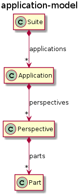
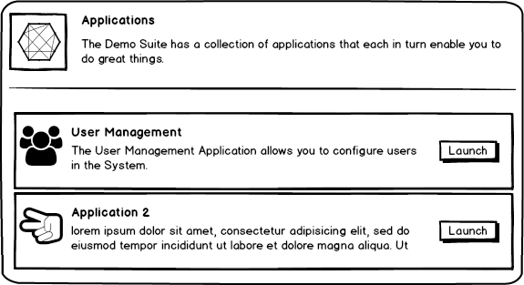
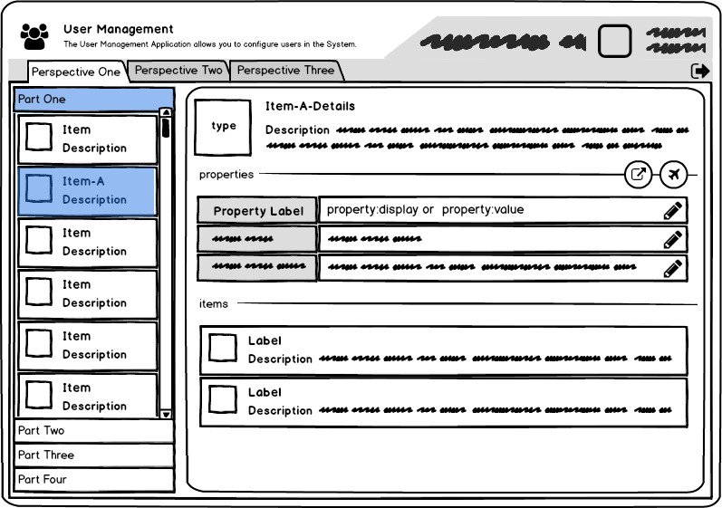

# An Application-Model

Let's try to think of the *UI* or an *Application* as just another domain model. The following Application-Model is based on the [e4](http://help.eclipse.org/neon/index.jsp?topic=%2Forg.eclipse.platform.doc.isv%2Freference%2Fapi%2Forg%2Feclipse%2Fe4%2Fui%2Fmodel%2Fapplication%2Fpackage-summary.html) and consists of a *Suite* of *Applications*. Each Application has many *Perspectives*. A Perspective may have multiple *Parts* which link to *Contents*. The following UML-class-diagram shows the basic structure.

These concepts may be represented just as any domain model within the [hyper-item](README.md) media type. 

The above concepts could be represented like depicted in the following two images.

After a *User-Login* an *Application-Launcher* as depicted above may be shown. This user has access to two *Applications* within the *Suite*. After launching an application the following screen might be shown.

Only a single Perspective may be shown at any given time. A default perspective representation might be a *Master-Details* layout. Each *Part* gets its own *Accordion*-Section. The *Content* will lead to a *Collection*-Item which will be rendered into this section. Selecting an *Item* in the collection will lead to the rendering of its *details*-Link in the *Details* section of the perspective. 

## Related Material

- [Hyper-Item](README.md): Hyper-Item: a hypermedia specification
- [e4](http://help.eclipse.org/neon/index.jsp?topic=%2Forg.eclipse.platform.doc.isv%2Freference%2Fapi%2Forg%2Feclipse%2Fe4%2Fui%2Fmodel%2Fapplication%2Fpackage-summary.html)